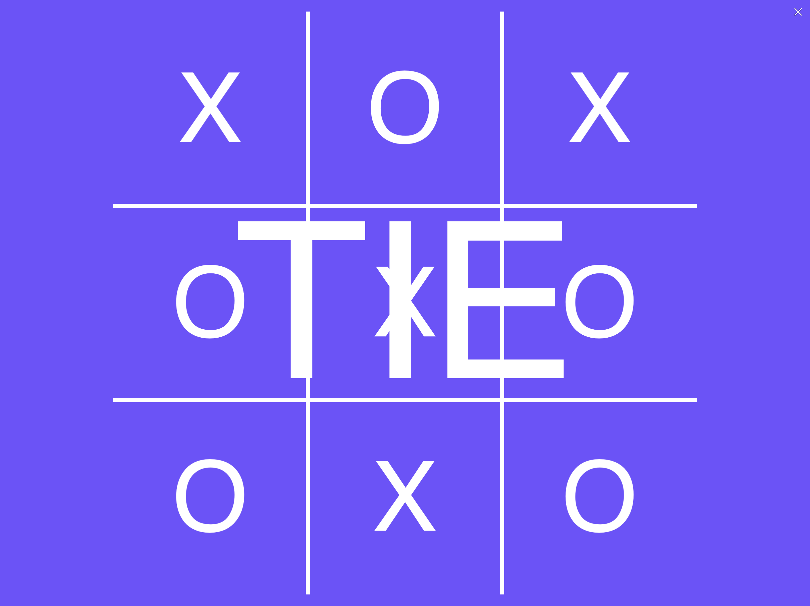

# python-tic-tac-toe

A Pythonista rendition of tic tac toe utilizing the minimax algorithm

## Getting Started

These instructions will get you a copy of the project up and running on your local machine for testing purposes.

### Prerequisites

- An iPad with pythonista and working copy

### Installing and Running

Fork the repository then clone it into working copy. Then, open the external folder in Pythonista.
Finally, press the play button to play the game

Examples

## Authors

* **Michael Roush** - *Project completion*

## License

Copyright © 2020 Michael Roush. All rights reserved.

